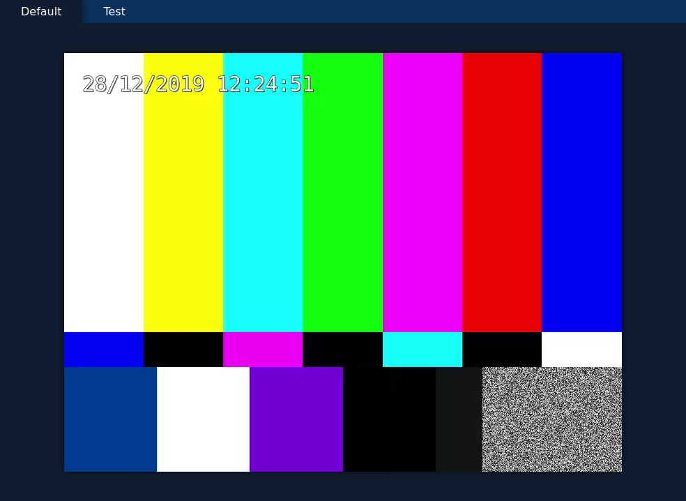

### Omniroom
Realtime video monitoring

## Overview
Omniroom is divided into 2 parts:
- a server that operates at the same time, as a signaling server and as a web server.

    Signaling part: It's role is to manage websockets communications

    Web server: To serve web pages to web browser clients

- a camera service that capture or generates a video flux and send it through websockets and WebRTC.

[Server repository](https://github.com/room-2135/omniroom-server)

[Camera repository](https://github.com/room-2135/omniroom-camera)

## Websockets protocol

A message has the form:
```
{
    command: 'COMMAND',
    identifier: '0123456789',
    [...]
}
```

When a message is sent, the identifier field refers to the target of the message. The signaling server replaces the value by the identifier of the sender so that the receiver knows from who the message is.

Here is a list of all the commands used by the protocol:

- JOIN_CLIENT:

    Every client registers itself to server and it is the server that sends back a unique identifier to the client.

- JOINED_CLIENT
- JOIN_CAMERA:

    Every camera registers itself to the server by sending its identifier.

- JOINED_CAMERA
- CALL:

    The client initiate a CALL to a camera by specifying its identifier

- CAMERA_UPDATE:

    When a camera is started, it will send a CAMERA_UPDATE to notify all active clients that a new camera is available and so that they can initiate a CALL.

- SDP_OFFER:

    When a call is initiated, the camera will send SDP offers to the client and the client will respond with an SDP answer. It specifies the video format that will be used.

- SDP_ANSWER
- ICE_CANDIDATE:

    When a call is initiated, the camera will also send ICE candidates to the client and the client will send back ICE answers. It specifies the different network nodes that will be used to forward the stream.

- ICE_ANSWER

# Screenshot

